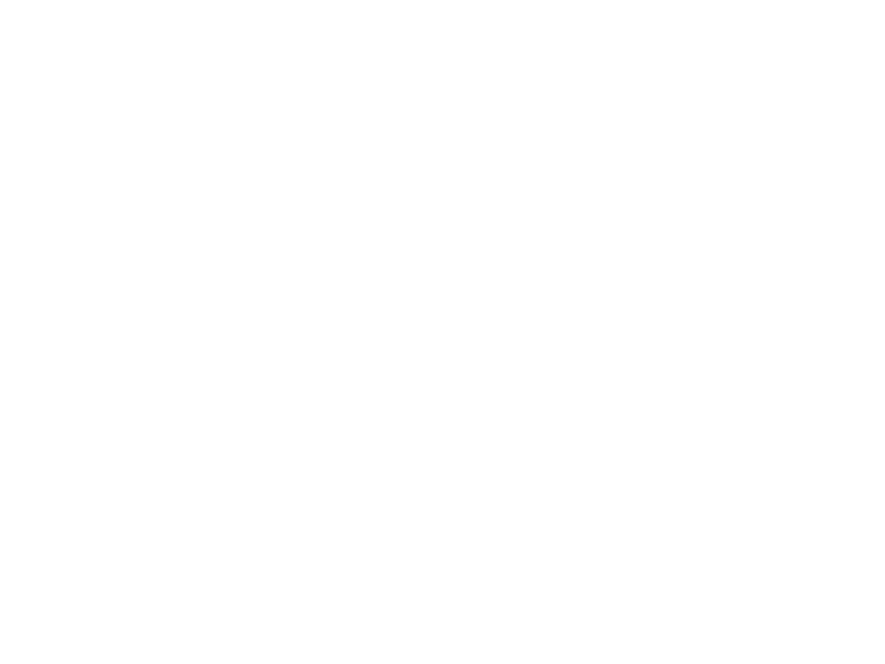

<div align="center">

<picture>
  <source media="(prefers-color-scheme: dark)" srcset="public/images/logo-white.png">
  <source media="(prefers-color-scheme: light)" srcset="public/images/logo-black.png">
  
</picture>

<br />
<br />

# People Growth Africa

**Institutional People Systems and Organizational Infrastructure for High-Growth African Enterprises**

[](https://react.dev/)
[](https://www.typescriptlang.org/)
[](https://vitejs.dev/)
[](https://tailwindcss.com/)
[](https://www.framer.com/motion/)
[](https://oxc.rs/)

<br />

[Executive Overview](#executive-overview) &bull;
[Key Specialities](#key-specialities) &bull;
[Technology Stack](#technology-stack) &bull;
[System Architecture](#system-architecture) &bull;
[Repository Structure](#repository-structure) &bull;
[Getting Started](#getting-started) &bull;
[Design System](#design-system--brand-identity) &bull;
[Deployment](#deployment)

</div>

---

## Executive Overview

**People Growth Africa (PGA)** is an HR and organizational consulting practice headquartered in Lagos, Nigeria. The firm specializes in architecting structured, culturally congruent, and legally compliant people systems for SMEs, agribusinesses, and growth-stage enterprises operating across the African continent.

This repository houses the official digital platform for People Growth Africa, delivering an interactive advisory interface, an enterprise-grade knowledge hub, and self-service diagnostic capabilities.

### Strategic Foundation

* **Vision**: A Pan-African economy where enterprises of all scales command world-class people practices, aligning organizational profitability directly with workforce development.
* **Mission**: To help organizations across Africa build the talent, systems, and cultures that turn everyday operations into sustainable, scalable growth.
* **Core Market**: Growth-stage ventures, agribusinesses, technology companies, and SMEs spanning 10 to 100+ employees seeking transition from informal staffing to structured people governance.

### Foundational Values

| Principle | Strategic Focus |
| :--- | :--- |
| **Transparency** | Clear, actionable diagnostic insights without corporate jargon or hidden agendas. |
| **Excellence** | Evidence-based methodologies adapted specifically to African business realities. |
| **Partnership** | Long-term operational embedding to ensure internal capability transfer. |
| **Local Expertise** | Deep adherence to regional labor laws, workforce dynamics, and cultural context. |

---

## Key Specialities

The platform represents the comprehensive advisory portfolio of People Growth Africa across fifteen core disciplines:

* **Strategic HR Advisory & Retainerships**: Embedded ongoing strategic guidance for leadership teams.
* **Nigerian Labour Law & Compliance**: Audits, regulatory risk mitigation, and compliance frameworks.
* **Organisational Architecture**: Job family structuring, grade level design, and reporting hierarchies.
* **Performance & OKR Systems**: Objective setting, continuous appraisal cycles, and KPI tracking.
* **Agribusiness Workforce Systems**: Specialized operational HR designed for agricultural enterprises.
* **Talent Acquisition & Onboarding**: Structured hiring pipelines, assessment frameworks, and induction.
* **Learning & Capability Development**: Competency matrix design and corporate training academies.
* **Culture & Employee Engagement**: Workplace climate assessment, retention programs, and value alignment.

---

## Technology Stack

The web application is engineered with modern frontend technologies focused on extreme performance, sub-millisecond route transitions, and responsive layout fidelity.

| Layer | Technology | Specification / Version | Purpose |
| :--- | :--- | :--- | :--- |
| **Runtime & Core** | React | `v19.2.x` | Modern component architecture and concurrent rendering |
| **Type System** | TypeScript | `v6.0.x` | Static typing and domain model enforcement |
| **Tooling & HMR** | Vite | `v8.2.x` | Next-generation frontend build tooling and rapid HMR |
| **Styling Engine** | Tailwind CSS | `v4.3.x` | Modern styling engine with custom theme token design |
| **Motion Physics** | Framer Motion | `v13.1.x` | Scroll-triggered transitions and micro-interactions |
| **Routing** | React Router | `v7.18.x` | Client-side routing with deep link and history support |
| **Static Analysis** | Oxlint | `v1.79.x` | High-performance Rust-based JavaScript/TypeScript linter |

---

## System Architecture

```
                                +---------------------------+
                                |      Browser Client       |
                                +-------------+-------------+
                                              |
                                              v
                                +---------------------------+
                                |  React 19 + Router Core   |
                                +-------------+-------------+
                                              |
                      +-----------------------+-----------------------+
                      |                                               |
                      v                                               v
        +---------------------------+                   +---------------------------+
        |     Presentation Layer    |                   |       Content Engine      |
        | - Fraunces / DM Sans Typo |                   | - Structured Articles     |
        | - Tailwind v4 Tokens      |                   | - Categorized Feed        |
        | - Framer Motion Engine    |                   | - SEO Meta Controllers    |
        +---------------------------+                   +---------------------------+
                      |                                               |
                      +-----------------------+-----------------------+
                                              |
                                              v
                                +---------------------------+
                                |  Optimized Production     |
                                |  Static Artifacts (dist)  |
                                +---------------------------+
```

### Route Map

* `/` &mdash; **Executive Homepage**: Value proposition, service catalog, interactive FAQ accordion, diagnostic booking, and lead intake.
* `/blog` &mdash; **Knowledge Base**: Curated publications on African labor policies, leadership strategies, and workforce optimization.
* `/blog/:slug` &mdash; **Article Reader**: Comprehensive long-form content layout with reading estimations and related publication feeds.
* `/*` &mdash; **404 Recovery**: Contextual fallback router with return navigation.

---

## Repository Structure

```
pga-web/
├── public/
│   ├── images/
│   │   ├── icon-black.png       # Brand icon mark (dark variant)
│   │   ├── icon-white.png       # Brand icon mark (light variant)
│   │   ├── logo-black.png       # Master corporate logo (dark variant)
│   │   └── logo-white.png       # Master corporate logo (light variant)
│   ├── favicon.svg              # Scalable SVG site favicon
│   └── icons.svg                # System icon sprite definitions
├── src/
│   ├── assets/                  # Local component media and static assets
│   ├── components/
│   │   ├── AnimateOnScroll.tsx  # Viewport intersection animation wrapper
│   │   ├── Footer.tsx           # Institutional footer and navigation matrix
│   │   ├── Layout.tsx           # Global chrome layout wrapper
│   │   ├── Navbar.tsx           # Responsive header navigation
│   │   └── SEO.tsx              # Dynamic document title and OpenGraph tags
│   ├── data/
│   │   └── posts.ts             # Typed publication catalog and content store
│   ├── hooks/                   # Custom application React hooks
│   ├── lib/                     # Utilities and helper libraries
│   ├── pages/
│   │   ├── BlogList.tsx         # Filterable knowledge base directory
│   │   ├── BlogPost.tsx         # Long-form article reader view
│   │   ├── Home.tsx             # Primary corporate landing experience
│   │   └── NotFound.tsx         # 404 error state view
│   ├── App.tsx                  # Root routing and application composition
│   ├── index.css                # Tailwind theme tokens and base typography
│   └── main.tsx                 # DOM mounting and application entry point
├── .oxlintrc.json               # Oxlint static analysis ruleset
├── package.json                 # Dependency matrix and execution scripts
├── tsconfig.json                # TypeScript compiler configuration
└── vite.config.ts               # Vite bundler and build configuration
```

---

## Getting Started

### Prerequisites

* **Node.js**: `v20.x` or later (LTS recommended)
* **npm**: `v10.x` or later (or equivalent package manager: `pnpm`, `yarn`, `bun`)

### Installation

Clone the repository and install all required workspace dependencies:

```bash
git clone https://github.com/kamyCodes/People-Growth-Africa.git
cd People-Growth-Africa
npm install
```

### Development Server

Start the local development server with Hot Module Replacement (HMR):

```bash
npm run dev
```

The application will be accessible at `http://localhost:5173`.

### Code Quality and Linting

Execute static analysis across the codebase via Oxlint:

```bash
npm run lint
```

### Production Build

Compile and optimize the source code into static assets for production distribution:

```bash
npm run build
```

Verify the production build locally via Vite's preview server:

```bash
npm run preview
```

---

## Design System & Brand Identity

The platform utilizes a tailored design language reflecting the natural landscapes, resilience, and economic ambition of the African continent.

### Corporate Palette

| Token Name | Hex Code | Swatch Preview | Usage Context |
| :--- | :--- | :--- | :--- |
| `--color-deep-green` | `#0F6E56` | `■ #0F6E56` | Primary brand identifier, executive banners, accent badges |
| `--color-brand-green` | `#1D9E75` | `■ #1D9E75` | Interactive controls, active states, key emphasis elements |
| `--color-mint` | `#E1F5EE` | `■ #E1F5EE` | Card backgrounds, badge containers, light highlights |
| `--color-terracotta` | `#C4773B` | `■ #C4773B` | Warm secondary accents, callout markers, section contrast |
| `--color-cream` | `#F2EDE4` | `■ #F2EDE4` | Subtle surface contrasts, secondary backgrounds |
| `--color-charcoal` | `#1A1E1B` | `■ #1A1E1B` | High-contrast typography, structural dark backgrounds |

### Typography Tokens

* **Display & Heading**: `Fraunces` &mdash; High-character serif typeface delivering an authoritative, bespoke institutional presence.
* **Body & User Interface**: `DM Sans` &mdash; High-legibility geometric sans-serif engineered for digital interfaces.

### Brand Assets Matrix

<div align="center">

| Master Logo (Dark) | Master Logo (Light) | Icon Mark (Dark) | Icon Mark (Light) |
| :---: | :---: | :---: | :---: |
|  |  |  |  |
| `public/images/logo-black.png` | `public/images/logo-white.png` | `public/images/icon-black.png` | `public/images/icon-white.png` |

</div>

---

## Deployment

The application is structured as a single-page application (SPA) and can be deployed to any modern static hosting provider or containerized web server.

### Recommended Providers

* **Vercel**: Seamless integration with automatic preview deployments and SPA rewrites (`rewrites: [{ "source": "/(.*)", "destination": "/" }]`).
* **Netlify**: Automatic branch previews with standard redirect rule (`/* /index.html 200`).
* **Cloudflare Pages**: High-performance edge static asset distribution.
* **Nginx / Custom Container**: Ensure all routes fallback to `index.html` for client-side routing resolution.

---

## Governance & License

All rights reserved &copy; 2025–2026 **People Growth Africa**.

Proprietary enterprise platform engineered for People Growth Africa. Internal architectural patterns and corporate assets may not be reproduced without explicit written consent.
